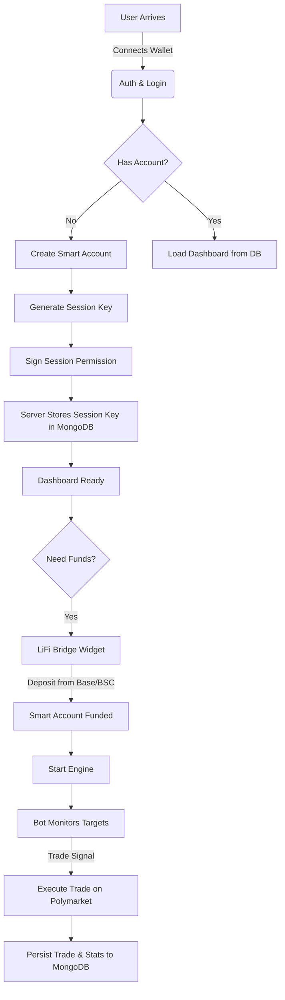

# 🏛️ Bet Mirror Pro | System Architecture

> **World Class Security & Automation**
> A hybrid architecture combining the speed of server-side execution with the security of Account Abstraction and the reliability of MongoDB persistence.

---

## 1. High Level Overview

The system allows users to "Mirror" (Copy Trade) high-performance wallets on Polymarket. It differentiates itself from standard bots by using **Smart Accounts** to ensure the server never takes custody of user funds, while using a centralized **MongoDB** database to ensure state persistence across server restarts.

### The "Trustless" Promise
1.  **Funds** live in a Smart Contract on Polygon.
2.  **User (Owner)** has absolute control (Withdraw/Admin).
3.  **Server (Bot)** has a restricted **Session Key** (Trade Only).
4.  **Database** stores configuration and history, but **never** private keys (except encrypted session keys).

---

## 2. User Journey Flow



---

## 3. Data Persistence & State Management

Unlike MVP versions that relied on `json` files or browser storage, Bet Mirror Pro uses a robust **MongoDB** architecture.

### Database Schema
*   **Users:** Stores wallet config, encrypted session keys, and bot preferences (Risk profile, Multipliers).
*   **Trades:** Immutable log of every executed trade, including AI reasoning and Risk Scores.
*   **Registry:** Global leaderboard data for the Alpha Marketplace.
*   **BridgeTransactions:** Cross-chain deposit history (persisted from LiFi events).

### Server Lifecycle
1.  **Startup:** Server connects to MongoDB Atlas.
2.  **Restoration:** Server queries `Users` collection for `isBotRunning: true`.
3.  **Rehydration:** It automatically restarts `BotEngine` instances for those users, using the stored configuration and the last known `activePositions`.
4.  **Termination:** On stop, final state is saved to DB to ensure no PnL data is lost.

---

## 4. Security Architecture (Account Abstraction)

We use **ZeroDev (Kernel v3.1)** to implement ERC-4337 Smart Accounts.

### The Key Hierarchy

| Key Type | Held By | Permissions | Security Level |
| :--- | :--- | :--- | :--- |
| **Owner Key** | User's MetaMask / Phantom | `Admin`, `Withdraw`, `Revoke` | 🔴 Critical (Cold) |
| **Session Key** | Bot Server (Node.js) | `CreateOrder`, `CancelOrder` | 🟡 Restricted (Hot) |

### Withdrawal Flow (Trustless)
Even if the server is offline or malicious, the user can withdraw.

1.  User clicks "Withdraw" on Client.
2.  Client SDK creates a `UserOperation`.
3.  **CallData:** `USDC.transfer(UserAddress, Balance)`.
4.  User signs `UserOp` with **Owner Key**.
5.  UserOp is sent to Bundler (ZeroDev).
6.  Smart Account executes transfer.

---

## 5. Cross-Chain Onboarding (LiFi)

We use **LiFi SDK** to abstract the complexity of bridging.

**Scenario:** User has 100 USDC on **Base**.
1.  **Quote:** SDK finds best route (e.g., Stargate or Across).
2.  **Transaction:** User signs 1 TX on Base.
3.  **Execution:** Funds move Base -> Polygon -> User's Smart Account.
4.  **Tracking:** Transaction status is pushed to the Server API and saved to `BridgeTransactions` collection.

---

## 6. Technology Stack

- **Frontend:** React, Vite, Tailwind, Lucide Icons.
- **Web3:** Viem, Ethers.js, ZeroDev SDK, LiFi SDK.
- **Backend:** Node.js (Express), Polymarket CLOB Client.
- **Database:** **MongoDB** (Mongoose ODM) - *Replaces legacy JSON storage.*
- **AI:** Google Gemini 2.5 Flash (Risk Analysis).

---

## 7. Directory Structure

```
src/
├── app/                 # CLI Entry points
├── config/              # Env variables & Constants
├── database/            # MongoDB Connection & Mongoose Models (User, Trade, Registry)
├── domain/              # TypeScript Interfaces (Types)
├── infrastructure/      # External Clients (Polymarket)
├── server/              # Backend API & Bot Engine
├── services/            # Core Logic
│   ├── ai-agent.service.ts       # Gemini Risk Analysis
│   ├── lifi-bridge.service.ts    # Cross-Chain Bridging
│   ├── zerodev.service.ts        # Account Abstraction
│   ├── trade-executor.service.ts # Execution Logic
│   ├── trade-monitor.service.ts  # Signal Detection
│   └── web3.service.ts           # Client-side Wallet Interaction
└── utils/               # Helpers
```

---

## 8. Roadmap

### Phase 1: Managed SaaS (Completed)
- [x] Server-side execution.
- [x] Basic EOA support.

### Phase 2: Persistence & Scale (Completed)
- [x] Migration from JSON files to **MongoDB**.
- [x] Auto-recovery of bots after server restart.
- [x] Centralized Trade History API.

### Phase 3: Account Abstraction (Current)
- [x] ZeroDev Smart Account integration.
- [x] Session Key delegation.

### Phase 4: Decentralized Registry (Next)
- [ ] Move the `Registry` MongoDB collection to an on-chain Smart Contract.
- [ ] Listers stake tokens to verify performance.
- [ ] Fee distribution handles automatically via smart contract splits.
