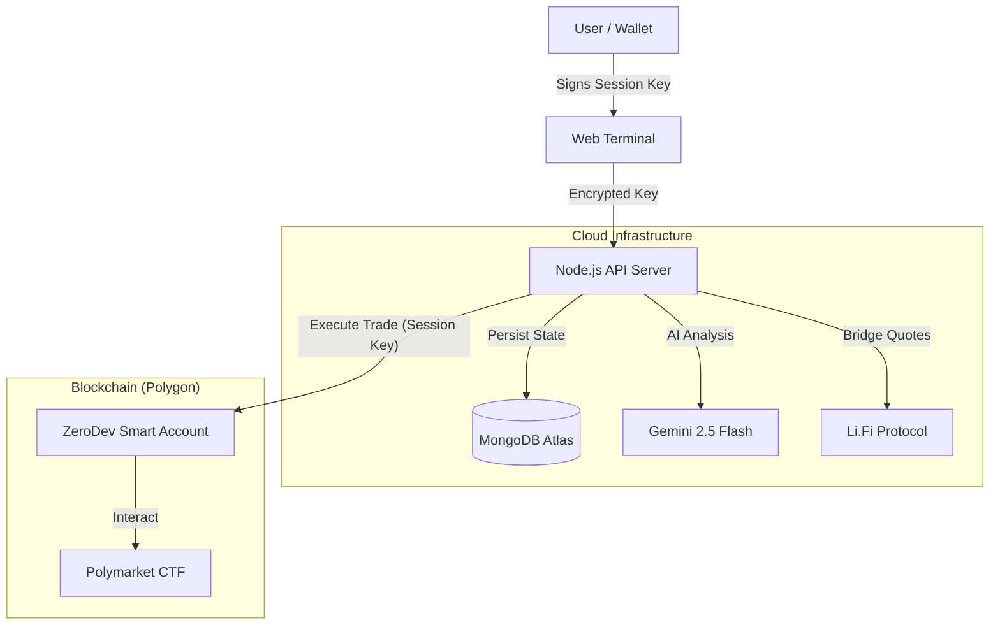

# Bet Mirror | Pro Cloud Terminal


**The world's first AI-powered, 24/7 server-side copy trading platform for Polymarket.**

Developed by **PolyCafe**.


**Bet Mirror Pro** is a sophisticated trading terminal that allows users to mirror high-performance Polymarket traders automatically. Unlike traditional bots that require your private keys, Bet Mirror Pro uses **Account Abstraction (ERC-4337)** to separate *Ownership* from *Trading Permissions*.

---

## 🚀 How It Works

Bet Mirror Pro transforms complex algorithmic trading into a simple 3-step process for the end user.

### 1. The Smart Onboarding
- **Connect:** User connects their standard EOA (Metamask, Phantom, Rabinbow).
- **Deploy:** The app automatically deploys a **ZeroDev Smart Account** (Kernel v3.1) owned by the user.
- **Session Keys:** The user signs a specific "Session Key" that grants the Bot Server permission to **Trade Only**. The server cannot withdraw funds.

### 2. The Cloud Engine (Server-Side)
- **Persistence:** Once the bot is started, it runs on our Node.js cloud cluster backed by **MongoDB**.
- **Offline Trading:** The user can close their browser or turn off their computer. The bot continues to monitor markets and execute trades 24/7.
- **AI Analysis:** Before every trade, the **Google Gemini 2.5** Agent analyzes the market question to ensure it aligns with the user's risk profile (Conservative, Balanced, or Degen).

### 3. The Marketplace & Profit
- **Copy Trading:** Users browse the **Alpha Registry** to find whales with high win rates.
- **Fee Sharing:** When a user profits from a copied trade, a **1% fee** is automatically sent to the original trader (The Lister) and **1%** to the Platform.
- **Trustless Withdraw:** Users can trigger a forced withdrawal from the dashboard at any time, bypassing the server entirely.

---

## 📋 Managing Official Wallets (System Seeding)

You can seed the Marketplace with "Official" or "System" wallets (e.g., trusted whales) using a simple text file. This keeps your `.env` clean.

1.  **Create a file:** Create a file named `wallets.txt` in the root directory.
2.  **Add Addresses:** Paste wallet addresses using any of the following formats:

**Option A: Newlines (Recommended)**
```text
0x8894e0a0c962cb723c1976a4421c95949be2d4e3
0xd8dA6BF26964aF9D7eEd9e03E53415D37aA96045
```

**Option B: Commas**
```text
0x8894..., 0xd8dA..., 0x1234...
```

*The server will automatically load these on startup, deduplicate them, mark them as "OFFICIAL" in the database, and display them with a badge in the Marketplace UI.*

---

## 🖥️ Interface Preview

### 📊 The Dashboard
The command center. View your Real-Time PnL, Active Positions, and System Logs.
> *Displays wallet balances (Native & Smart Account), Live Trade Console, and Performance Metrics.*

### 🔒 The Vault
Security first. Configure your AI Risk settings and manage automation.
> *Manage API Keys, Risk Profiles (Conservative/Degen), Auto-Cashout thresholds, and SMS Notification settings.*

### 🌍 The Alpha Registry
A decentralized marketplace for trading signals.
> *A leaderboard of top Polymarket traders. Users can "One-Click Copy" any wallet listed here. Listers earn passive income from copiers.*

### 🌉 Cross-Chain Bridge
Fund your bot from anywhere.
> *Integrated Li.Fi Widget allows deposits from Ethereum, Base, Solana, and Arbitrum directly into the Polygon Smart Account.*

---

## 🏗 System Architecture

The platform uses a hybrid architecture combining the speed of centralized execution with the security of decentralized custody.

[📖 **Read the Full Architecture Guide**](./ARCHITECTURE.md)



### 💎 Key Features

#### 1. 🛡️ Non-Custodial Smart Accounts (ZeroDev)
We do not ask for your Private Key. Instead, the app deploys a **Smart Contract Wallet** owned by you.
- **Security:** You can revoke the bot's access on-chain at any time.
- **Gas Abstraction:** Future-proofed for gasless transactions.

#### 2. ☁️ Cloud Persistence (MongoDB Atlas)
Your bot runs 24/7 on the server.
- **Database:** Stores user configuration, trade history, and session keys securely.
- **Auto-Recovery:** If the server restarts, your bot automatically rehydrates from MongoDB and resumes trading without missing a beat.

#### 3. 🌉 Cross-Chain Bridge (Li.Fi)
Fund your trading bot from anywhere.
- **Supported Chains:** Ethereum, Base, Arbitrum, BSC, Solana.
- **One-Click:** Swaps and Bridges funds directly into your Polygon Smart Account in one transaction.

---

## 📸 Screenshots


*Real-time Dashboard with Asset Matrix and Performance Metrics.*


*Cross-Chain Deposit via Li.Fi.*

---

## 🛠️ Technology Stack

*   **Frontend:** React, Vite, TailwindCSS, Lucide Icons.
*   **Backend:** Node.js, Express, TypeScript.
*   **Database:** MongoDB (Mongoose ODM).
*   **Web3:** Viem, Ethers.js, ZeroDev SDK (Kernel v3.1), Li.Fi SDK.
*   **AI:** Google GenAI SDK (Gemini 2.5).

---

## 🚀 Quick Start Guide

### 1. Prerequisites
- Node.js v18+
- MongoDB Atlas Cluster (Free Tier is fine)
- ZeroDev Project ID (Free Tier)
- Google Gemini API Key (Free)

### 2. Installation
```bash
git clone https://github.com/your-repo/bet-mirror.git
cd bet-mirror
npm install
```

### 3. Configuration
Create a `.env` file in the root directory:

```env
# --- Database (Required) ---
MONGODB_URI=mongodb+srv://<user>:<pass>@cluster.mongodb.net/?retryWrites=true&w=majority

# --- Account Abstraction (Required) ---
# Get this from dashboard.zerodev.app (Polygon Mainnet)
ZERODEV_PROJECT_ID=your_project_id
ZERODEV_RPC=https://rpc.zerodev.app/api/v2/bundler/your_project_id

# --- Admin Revenue ---
# Wallet that receives 1% platform fees
ADMIN_REVENUE_WALLET=0xYourColdWalletAddress
```

### 4. Run Development Environment
This starts both the Backend API (Port 3000) and Frontend (Port 5173).
```bash
npm run dev:all
```

### 5. Developer Tools
- **Wipe Database:** To reset your local environment (deletes Users/Trades/Registry).
  ```bash
  npm run db:wipe
  ```
  *(Requires user confirmation. Useful for testing the Activation/Restoration flow from scratch).*

### 6. Production Build (Docker)
Deploying to a cloud provider (Railway, Sliplane, DigitalOcean)? Use the Dockerfile.
```bash
docker build -t bet-mirror .
docker run -p 3000:3000 -e MONGODB_URI=... bet-mirror
```

---

## 🔒 Security Model

| Component | Responsibility | Access Level |
| :--- | :--- | :--- |
| **Owner Key** | Held by User (Phantom/Metamask) | **Full Admin**. Can withdraw funds, revoke keys, update settings. |
| **Session Key** | Held by Server (Encrypted DB) | **Limited**. Can only execute trades. Cannot withdraw. |
| **Database** | MongoDB Atlas | Stores Config, History, and Encrypted Session Keys. |

---

## ⚠️ Disclaimer

This software is for educational purposes only. Prediction markets involve risk. The "Trustless" architecture protects against server-side theft, but it does not protect against bad trading decisions or smart contract bugs. Use at your own risk.
