# Bet Mirror | Pro Cloud Terminal


**Institutional-grade Polymarket Copy Trading Terminal. Features Non-Custodial Smart Accounts (ERC-4337), AI Risk Analysis (Gemini), and Cross-Chain funding via Li.Fi.**

**Bet Mirror Pro** is an enterprise-grade trading terminal designed to democratize algorithmic prediction market trading. Unlike traditional bots that require custodial private keys, Bet Mirror leverages **ERC-4337 Account Abstraction** to offer a fully non-custodial solution. Users retain full control of their funds while granting restricted "Session Keys" to a cloud-based engine that executes trades 24/7 based on **AI Risk Analysis** and **Copy Trading signals**. The platform includes a built-in "Alpha Registry" marketplace, rewarding top traders with a 1% protocol fee from every copier.

Developed by **PolyCafe**.


---

## 🚀 How It Works

Bet Mirror Pro transforms complex algorithmic trading into a simple 3-step process for the end user.

### 1. The Smart Onboarding
- **Connect:** User connects their standard EOA (Metamask, Phantom, Rainbow).
- **Network Check:** The app will prompt you to switch to **Polygon** to sign the activation. 
  > *Why?* Your Smart Account lives on Polygon. Even if your funds are on Base or Solana, your Wallet acts as the "Root Admin" on the Polygon network to control the bot.
- **Deploy:** The app automatically deploys a **ZeroDev Smart Account** (Kernel v3.1) owned by your wallet.
- **Session Keys:** You sign a specific "Session Key" that grants the Bot Server permission to **Trade Only**. The server cannot withdraw funds.

### 2. The Cloud Engine (Server-Side)
- **Persistence:** Once the bot is started, it runs on our Node.js cloud cluster backed by **MongoDB**.
- **Offline Trading:** The user can close their browser or turn off their computer. The bot continues to monitor markets and execute trades 24/7.
- **AI Analysis:** Before every trade, the **Google Gemini 2.5** Agent analyzes the market question to ensure it aligns with the user's risk profile (Conservative, Balanced, or Degen).

### 3. The Marketplace & Profit
- **Copy Trading:** Users browse the **Alpha Registry** to find whales with high win rates.
- **Fee Sharing:** When a user profits from a copied trade, a **1% fee** is automatically sent to the original trader (The Lister) and **1%** to the Platform.
- **Trustless Withdraw:** Users can trigger a forced withdrawal from the dashboard at any time, bypassing the server entirely.

---

## 📈 Live Analytics Engine

The Alpha Marketplace is powered by a dedicated **Registry Analytics Service**.

*   **Real-Time Data:** The system fetches raw trade history from the Polymarket Data API for every listed wallet.
*   **Win Rate Calculation:** It tracks "Round Trip" trades (Buying an outcome and Selling it later) to calculate realized PnL and Win Rates accurately.
*   **Auto-Update:** A background worker updates these stats in the MongoDB Registry every 15 minutes.
*   **Deep Dive:** Users can click on any trader in the Marketplace to see a detailed modal with their last 50 transactions.

---

## 👷 Builder Program Integration

This platform is a registered **Polymarket Builder**. Every trade executed by the bot is cryptographically stamped with **Attribution Headers**.

**To configure your Builder Keys (For Platform Admins):**
Add the following to your `.env` file to enable stamping:

```env
POLY_BUILDER_API_KEY=your_builder_key
POLY_BUILDER_SECRET=your_builder_secret
POLY_BUILDER_PASSPHRASE=your_passphrase
```

---

## 📋 Managing Official Wallets

You can seed the Marketplace with "Official" or "System" wallets (e.g., trusted whales) using a simple text file.

1.  **Create a file:** Create a file named `wallets.txt` in the root directory.
2.  **Add Addresses:** Paste wallet addresses using any of the following formats:

```text
0x8894e0a0c962cb723c1976a4421c95949be2d4e3
0xd8dA6BF26964aF9D7eEd9e03E53415D37aA96045
```

*The server will automatically load these on startup, mark them as "OFFICIAL", and display them with a badge.*

---

## 🖥️ Interface Preview

### 📊 The Dashboard
The command center. View your Real-Time PnL, Active Positions, and System Logs.
> *Displays wallet balances (Native & Smart Account), Live Trade Console, and Performance Metrics.*

### 🔒 The Vault
Security first. Configure your AI Risk settings and manage automation.
> *Manage API Keys, Risk Profiles (Conservative/Degen), Auto-Cashout thresholds, and SMS Notification settings.*

### 🌍 The Alpha Registry
A decentralized marketplace for trading signals.
> *A leaderboard of top Polymarket traders. Users can "One-Click Copy" any wallet listed here.*

### 🌉 Cross-Chain Bridge
Fund your bot from anywhere.
> *Integrated Li.Fi Widget allows deposits from Ethereum, Base, Solana, and Arbitrum directly into the Polygon Smart Account.*

---

## 🏗 System Architecture

The platform uses a hybrid architecture combining centralized execution speed with decentralized custody.

```mermaid
graph TD
    subgraph "Client Layer"
        User(("👤 User (EOA)"))
        Browser["🖥️ Web Terminal (React)"]
    end

    subgraph "Cloud Infrastructure"
        API["⚙️ Node.js API Cluster"]
        DB[("🗄️ MongoDB Atlas")]
        Gemini["🧠 Gemini 2.5 AI"]
    end

    subgraph "Blockchain & Execution"
        LiFi["🌉 Li.Fi Protocol"]
        ZeroDev["🛡️ ZeroDev Bundler"]
        SmartAccount["🏦 Kernel Smart Account (Polygon)"]
        CLOB["⚡ Polymarket CLOB"]
    end

    %% Flows
    User -->|"1. Connect & Sign Session"| Browser
    Browser -->|"2. Bridge Funds"| LiFi
    LiFi -.->|"USDC Deposit"| SmartAccount
    
    Browser -->|"3. Encrypted Session Key"| API
    API <-->|"4. Persist State"| DB
    
    API -->|"5. Risk Analysis"| Gemini
    
    API -->|"6. Sign Trade (Builder Headers)"| ZeroDev
    ZeroDev -->|"7. Execute UserOp"| SmartAccount
    SmartAccount -->|"8. Settle Trade"| CLOB
```



---

## 📸 Screenshots


*Real-time Dashboard with Asset Matrix and Performance Metrics.*


*Cross-Chain Deposit via Li.Fi.*

---

## 🛠️ Technology Stack

*   **Frontend:** React, Vite, TailwindCSS, Lucide Icons.
*   **Backend:** Node.js, Express, TypeScript.
*   **Database:** MongoDB (Mongoose ODM).
*   **Web3:** Viem, Ethers.js, ZeroDev SDK (Kernel v3.1), Li.Fi SDK.
*   **AI:** Google GenAI SDK (Gemini 2.5).

---

## 🚀 Quick Start Guide

### 1. Prerequisites
- Node.js v18+
- MongoDB Atlas Cluster (Free Tier is fine)
- ZeroDev Project ID (Free Tier)
- Google Gemini API Key (Free)

### 2. Installation
```bash
git clone https://github.com/your-repo/bet-mirror.git
cd bet-mirror
npm install
```

### 3. Configuration
Create a `.env` file in the root directory:

```env
# --- Database (Required) ---
MONGODB_URI=mongodb+srv://<user>:<pass>@cluster.mongodb.net/?retryWrites=true&w=majority

# --- Account Abstraction (Required) ---
# Get this from dashboard.zerodev.app (Polygon Mainnet)
ZERODEV_PROJECT_ID=your_project_id
ZERODEV_RPC=https://rpc.zerodev.app/api/v2/bundler/your_project_id

# --- Admin Revenue ---
# Wallet that receives 1% platform fees
ADMIN_REVENUE_WALLET=0xYourColdWalletAddress
```

### 4. Run Development Environment
This starts both the Backend API (Port 3000) and Frontend (Port 5173).
```bash
npm run dev:all
```

### 5. Developer Tools
- **Wipe Database:** To reset your local environment (deletes Users/Trades/Registry).
  ```bash
  npm run db:wipe
  ```
  *(Requires user confirmation. Useful for testing the Activation/Restoration flow from scratch).*

### 6. Production Build (Docker)
Deploying to a cloud provider (Railway, Sliplane, DigitalOcean)? Use the Dockerfile.
```bash
docker build -t bet-mirror .
docker run -p 3000:3000 -e MONGODB_URI=... bet-mirror
```

---

## 🔒 Security Model

| Component | Responsibility | Access Level |
| :--- | :--- | :--- |
| **Owner Key** | Held by User (Phantom/Metamask) | **Full Admin**. Can withdraw funds, revoke keys, update settings. |
| **Session Key** | Held by Server (Encrypted DB) | **Limited**. Can only execute trades. Cannot withdraw. |
| **Database** | MongoDB Atlas | Stores Config, History, and Encrypted Session Keys. |

---

## ⚠️ Disclaimer

This software is for educational purposes only. Prediction markets involve risk. The "Trustless" architecture protects against server-side theft, but it does not protect against bad trading decisions or smart contract bugs. Use at your own risk.
