# Bet Mirror | Pro Cloud Terminal


**Institutional-grade Polymarket Copy Trading Terminal. Features Dedicated Gnosis Safes, AI Risk Analysis (Gemini), and Cross-Chain funding via Li.Fi.**

**Bet Mirror Pro** is an enterprise-grade trading terminal designed to democratize algorithmic prediction market trading. Unlike traditional bots that require you to keep your browser open, Bet Mirror uses a **Hybrid Cloud Architecture**. It deploys a **Gnosis Safe** (Smart Wallet) for every user, controlled by an encrypted EOA signer. This allows the cloud engine to execute **Gasless Trades** 24/7 via the Polymarket Relayer based on **AI Risk Analysis** and **Copy Trading signals**, while ensuring your main savings wallet remains untouched. The platform includes a built-in "Alpha Registry" marketplace, rewarding top traders with a 1% protocol fee from every copier.

Developed by **PolyCafe**.


---

## 🚀 How It Works

Bet Mirror Pro transforms complex algorithmic trading into a simple 3-step process for the end user.

### 1. The Smart Onboarding
- **Connect:** User connects their standard Main Wallet (Metamask, Phantom, Rainbow).
- **Deploy:** The system automatically derives and deploys a dedicated **Gnosis Safe** on Polygon.
- **Security:** An encrypted EOA key acts as the controller. It is stored using **AES-256**.
- **Isolation:** Funds sit in the Safe, distinct from your main savings.

### 2. The Cloud Engine (Server-Side)
- **Persistence:** Once the bot is started, it runs on our Node.js cloud cluster backed by **MongoDB**.
- **Offline Trading:** The user can close their browser or turn off their computer. The bot continues to monitor markets and execute trades 24/7.
- **AI Analysis:** Before every trade, the **Google Gemini 2.5** Agent analyzes the market question to ensure it aligns with the user's risk profile (Conservative, Balanced, or Degen).

### 3. The Marketplace & Profit
- **Copy Trading:** Users browse the **Alpha Registry** to find whales with high win rates.
- **Fee Sharing:** When a user profits from a copied trade, a **1% fee** is automatically sent to the **Lister** (the user who found and listed the wallet) and **1%** to the Platform. This rewards discovery.
- **Withdrawal:** Users can trigger a withdrawal from the dashboard at any time, sweeping funds back to their Main Wallet.

---

## 📈 Live Analytics Engine

The Alpha Marketplace is powered by a dedicated **Registry Analytics Service**.

*   **Real-Time Data:** The system fetches raw trade history from the Polymarket Data API for every listed wallet.
*   **Win Rate Calculation:** It tracks "Round Trip" trades (Buying an outcome and Selling it later) to calculate realized PnL and Win Rates accurately.
*   **Auto-Update:** A background worker updates these stats in the MongoDB Registry every 15 minutes.
*   **Deep Dive:** Users can click on any trader in the Marketplace to see a detailed modal with their last 50 transactions.

---

## 👷 Builder Program Integration

This platform is a registered **Polymarket Builder**. Every trade executed by the bot is cryptographically stamped with **Attribution Headers**.

**To configure your Builder Keys (For Platform Admins):**
Add the following to your `.env` file to enable stamping and relayer access:

```env
POLY_BUILDER_API_KEY=your_builder_key
POLY_BUILDER_SECRET=your_builder_secret
POLY_BUILDER_PASSPHRASE=your_passphrase
```

---

## 📋 Managing Official Wallets

You can seed the Marketplace with "Official" or "System" wallets (e.g., trusted whales) using a simple text file.

1.  **Create a file:** Create a file named `wallets.txt` in the root directory.
2.  **Add Addresses:** Paste wallet addresses using any of the following formats:

```text
0x8894e0a0c962cb723c1976a4421c95949be2d4e3
0xd8dA6BF26964aF9D7eEd9e03E53415D37aA96045
```

*The server will automatically load these on startup, mark them as "OFFICIAL", and display them with a badge.*

---

## 🖥️ Interface Preview

### 📊 The Dashboard
The command center. View your Real-Time PnL, Active Positions, and System Logs.
> *Displays wallet balances (Main & Trading Wallet), Live Trade Console, and Performance Metrics.*

### 🔒 The Vault
Security first. Configure your AI Risk settings and manage automation.
> *Manage API Keys, Risk Profiles (Conservative/Degen), Auto-Cashout thresholds, and SMS Notification settings.*

### 🌍 The Alpha Registry
A decentralized marketplace for trading signals.
> *A leaderboard of top Polymarket traders. Users can "One-Click Copy" any wallet listed here.*

### 🌉 Cross-Chain Bridge
Fund your bot from anywhere.
> *Integrated Li.Fi Widget allows deposits from Ethereum, Base, Solana, and Arbitrum directly into the Polygon Trading Wallet.*

---

## 🏗 System Architecture

The platform uses a hybrid architecture combining centralized execution speed with encrypted security.

```mermaid
graph TD
    subgraph "Client Layer"
        User(("👤 User (Main Wallet)"))
        Browser["🖥️ Web Terminal (React)"]
    end

    subgraph "Cloud Infrastructure"
        API["⚙️ Node.js API Cluster"]
        DB[("🗄️ MongoDB Atlas")]
        Gemini["🧠 Gemini 2.5 AI"]
    end

    subgraph "Blockchain & Execution"
        LiFi["🌉 Li.Fi Protocol"]
        Safe["🔐 Gnosis Safe (Funder)"]
        Relayer["⚡ Polymarket Relayer"]
        CLOB["⚡ Polymarket CLOB"]
    end

    %% Flows
    User -->|"1. Connect & Auth"| Browser
    Browser -->|"2. Bridge Funds"| LiFi
    LiFi -.->|"USDC Deposit"| Safe
    
    Browser -->|"3. Request Activation"| API
    API -->|"4. Deploy Safe & Encrypt Signer"| DB
    
    API -->|"5. Risk Analysis"| Gemini
    
    API -->|"6. Sign Trade (EOA Key)"| API
    API -->|"7. Submit to Relayer"| Relayer
    Relayer -->|"8. Execute via Safe"| CLOB
```



---

## 🔌 Extensibility & Plugins

Bet Mirror Pro utilizes a **Plugin-based Interface Architecture** (`IExchangeAdapter`) to decouple the core trading logic from specific market implementations.

### The `IExchangeAdapter` Pattern
The core `BotEngine` does not communicate directly with the Polymarket API. Instead, it talks to a standardized interface located at `src/adapters/interfaces.ts`.

This allows for seamless integration of new prediction markets (e.g., **PredictBase**, **Kalshi**) without rewriting the bot's risk management, database, or notification logic.

**How to add a new market:**
1.  **Create Adapter:** Implement `src/adapters/predictbase/predictbase.adapter.ts`.
2.  **Implement Methods:** Fulfill the `IExchangeAdapter` contract (`getPositions`, `createOrder`, `fetchBalance`).
3.  **Dependency Injection:** Swap the adapter import in `src/server/bot-engine.ts`.

---

## 📸 Screenshots


*Real-time Dashboard with Asset Matrix and Performance Metrics.*


*Cross-Chain Deposit via Li.Fi.*

---

## 🛠️ Technology Stack

*   **Frontend:** React, Vite, TailwindCSS, Lucide Icons.
*   **Backend:** Node.js, Express, TypeScript.
*   **Database:** MongoDB (Mongoose ODM).
*   **Web3:** Viem, Ethers.js, @polymarket/builder-relayer-client.
*   **AI:** Google GenAI SDK (Gemini 2.5).

---

## 🚀 Quick Start Guide

### 1. Prerequisites
- Node.js v20+
- MongoDB Atlas Cluster (Free Tier is fine)
- Google Gemini API Key (Free)

### 2. Installation
```bash
git clone https://github.com/your-repo/bet-mirror.git
cd bet-mirror
npm install
```

### 3. Configuration
Create a `.env` file in the root directory:

```env
# --- Database (Required) ---
MONGODB_URI=mongodb+srv://<user>:<pass>@cluster.mongodb.net/?retryWrites=true&w=majority

# --- Security (Required) ---
# A random 32-byte string for AES encryption. Generate one with `openssl rand -hex 32`
MONGO_ENCRYPTION_KEY=your_secure_random_key_here

# --- Admin Revenue ---
# Wallet that receives 1% platform fees
ADMIN_REVENUE_WALLET=0xYourColdWalletAddress
```

### 4. Run Development Environment
This starts both the Backend API (Port 3000) and Frontend (Port 5173).
```bash
npm run dev:all
```

### 5. Developer Tools
- **Wipe Database:** To reset your local environment (deletes Users/Trades/Registry).
  ```bash
  npm run db:wipe
  ```
  *(Requires user confirmation. Useful for testing the Activation/Restoration flow from scratch).*

### 6. Production Build (Docker)
Deploying to a cloud provider (Railway, Sliplane, DigitalOcean)? Use the Dockerfile.
```bash
docker build -t bet-mirror .
docker run -p 3000:3000 -e MONGODB_URI=... bet-mirror
```

---

## 🚑 Troubleshooting

### MongoDB Connection Error on Deployment
If you see `MongooseServerSelectionError` in your cloud logs (Sliplane, Railway, etc.), it means the server cannot reach MongoDB Atlas.

**Cause:** MongoDB Atlas blocks unknown IP addresses by default. Cloud providers use dynamic IPs.

**Fix:**
1.  Log in to **MongoDB Atlas**.
2.  Go to **Network Access** (Security sidebar).
3.  Click **+ Add IP Address**.
4.  Select **"Allow Access from Anywhere"** (0.0.0.0/0).
5.  Confirm. The deployment should now succeed on retry.

---

## 🔒 Security Model

| Component | Responsibility | Access Level |
| :--- | :--- | :--- |
| **Main Wallet** | Held by User (Phantom/Metamask) | **Fund Source**. Used to deposit and receive profits. Safely isolated. |
| **Gnosis Safe** | On-Chain Contract | **Funder**. Holds trading capital. Controlled by the Trading Key. |
| **Trading Key** | Held by Server (Encrypted DB) | **Execution**. Used to sign orders and Relayer requests. |
| **Database** | MongoDB Atlas | Stores Config, History, and Encrypted Keys. |

---

## ⚠️ Disclaimer

This software is for educational purposes only. Prediction markets involve risk. While we encrypt keys, this uses a custodial trading wallet model to enable automation. Never deposit more than you can afford to lose.
