# Bet Mirror | Professional Copy-Trading Terminal


**Institutional-Grade Trading Infrastructure for Polymarket. Powered by AI, Multi-Strategy Execution, and Enterprise Risk Management.**

**Bet Mirror Pro** redefines professional prediction market trading copy-trading and market-making with its **institutional-grade execution** and **sophisticated risk management** framework.

### 🏆 Why Choose Bet Mirror Pro?
- **Institutional Infrastructure**: Bank-grade security with **Gnosis Safe** multi-sig wallets and **enterprise-grade** encryption
- **Multi-Strategy Execution**: Simultaneously run **market making**, **statistical arbitrage**, and **trend following** strategies
- **AI-Powered Risk Engine**: Real-time market analysis and position management powered by **Gemini AI**
- **Zero-Downtime Cloud Execution**: 24/7 operation with **99.99% uptime** SLA
- **Institutional Liquidity**: Access to deep liquidity pools and **best execution** algorithms

### 🔄 Seamless Integration
- **One-Click Deployment**: Get started in minutes with automated wallet setup
- **REST API Access**: Full programmatic control for institutional users
- **Comprehensive Analytics**: Real-time PnL tracking, performance attribution, and risk metrics
- **Regulatory Ready**: Built with compliance and audit trails for institutional requirements

> *"Where institutional-grade trading meets the prediction markets revolution."*

Developed by **PolyCafe** | *Empowering the Future of Prediction Markets*


---

## 🏗 High-Performance Architecture

Bet Mirror Pro utilizes a proprietary **Single-Firehose, Multi-Tenant Execution Engine**. This architecture is specifically engineered to handle the high throughput of Polymarket's 5,000+ active tokens while remaining strictly immune to API rate limits (429 errors).

### The 4-Tier Intelligence Pipeline

1.  **The Discovery Authority (Scanner):** The `MarketMakingScanner` acts as the primary "hunter." It utilizes the bulk Gamma API to discover new markets and seed the global `MarketMetadata` database. It is the only service permitted to fetch metadata, ensuring a single point of truth.
2.  **The Nervous System (Intelligence Hub):** The `MarketIntelligenceService` is a shared singleton. It maintains **one** primary WebSocket firehose to the exchange. It parses raw data into refined events (whale trades, price spikes, order fills) and broadcasts them to all active bot instances in-memory.
3.  **The Tactical Brain (Bot Engine):** Each user is assigned a dedicated `BotEngine`. To ensure 429 resilience, the brain is **strictly passive** regarding metadata. It enriches whale signals by querying the local database or L1 memory cache, never triggering a redundant external API call.
4.  **The Execution Arm (Adapter & Safe):** The `PolymarketAdapter` manages the cryptographic signing. Using **Account Abstraction (Gnosis Safe)**, it executes trades gaslessly via the Polymarket Builder Relayer, handling nonce management and batch approvals automatically.

---

## 🏦 The Three Primary Trading Engines

### 1. Alpha Mirror (Copy-Trading)
The **Alpha Mirror** engine replicates the high-conviction moves of elite prediction market participants (Whales).
*   **Real-Time Replication:** Listens to the Intelligence Hub for specific wallet addresses. When a target enters a position, the bot executes a proportional trade within milliseconds.
*   **Smart Sizing:** Positions are scaled based on the user's `multiplier` and current vault liquidity.
*   **Fee Capture:** Users who discover and list successful whales in the Alpha Registry earn a 1% "Hunter Fee" from all followers who mirror that wallet.

### 2. Liquidity Engine (Market Making)
The **Liquidity Engine** provides depth to the market while capturing the bid-ask spread and protocol rewards.
*   **GTC Maker Orders:** Unlike aggressive "taker" bots, this engine places resting **Good-Til-Cancelled** orders. These orders qualify for Polymarket's liquidity mining rewards.
*   **Inventory Skew Management:** Automatically adjusts bid and ask prices based on current holdings. If the vault is "Long" (holds too many YES shares), it lowers the bid and raises the ask to incentivize a rebalancing trade.
*   **Spread Capture:** Dynamically identifies wide spreads to "scalp" the cent-difference between participants.

### 3. Fomo Runner (Flash Moves / HFT)
The **Fomo Runner** is a high-frequency momentum engine designed to capture explosive price spikes.
*   **Velocity Detection:** Analyzes sub-second price updates to identify "Flash Moves"—significant price changes within a narrow time window.
*   **High-Confidence Sniping:** When velocity exceeds a pre-defined threshold (e.g., 3% move in 10 seconds), the engine attempts to "chase" the momentum with a market-priced limit order.
*   **Combat Sequences:** Designed for volatile events where price discovery happens too fast for manual traders.

---

## 🏦 Money Market Features

### Dynamic Position Management
- **Volatility-Adjusted Sizing**: Positions scale based on market volatility and confidence levels
- **Liquidity-Weighted Allocation**: Distributes capital based on available market depth
- **Correlation Analysis**: Avoids overexposure to correlated markets
- **Time Decay Management**: Automatically adjusts positions based on time to market resolution

### Advanced Execution Strategies
- **TWAP/VWAP Execution**: Large orders are sliced and executed over time to minimize market impact
- **Dark Pool Integration**: For large block trades to prevent market signaling
- **Liquidity Seeking**: Aggregates liquidity across multiple venues when available
- **Smart Order Routing**: Automatically routes orders to the most favorable execution venue

### Risk-Aware Trading
- **Scenario Analysis**: Stress tests positions against historical and hypothetical market conditions
- **Liquidity Risk Monitoring**: Tracks market depth and adjusts position sizes accordingly
- **Counterparty Risk Assessment**: Monitors exchange and counterparty credit risk
- **Regulatory Compliance**: Built with compliance and audit trails for institutional requirements

## 🚀 How It Works

Bet Mirror Pro transforms complex algorithmic trading into a simple 3-step process for the end user.

### 1. The Smart Onboarding
- **Connect:** User connects their standard Main Wallet (Metamask, Phantom, Rainbow).
- **Deploy:** The system automatically derives and deploys a dedicated **Gnosis Safe** on Polygon.
- **Security:** An encrypted EOA key acts as the controller. It is stored using **AES-256-GCM** with authenticated encryption.
- **Isolation:** Funds sit in the Safe, distinct from your main savings.

### 2. The Cloud Engine (Server-Side)
- **Persistence:** Once the bot is started, it runs on our Node.js cloud cluster backed by **MongoDB**.
- **Triple-Engine Autonomous Execution:** 
    - **Alpha Mirror:** Replicates high-win-rate whales from the registry.
    - **Liquidity Engine:** Captures orderbook spreads via GTC maker orders.
    - **Fomo Runner:** Snipes high-velocity price spikes using HFT algorithms.
- **Passive Metadata Strategy:** The engine never hammers the CLOB API for market details. It uses the `MarketMetadataService` to pull data from a locally cached database seeded by the Discovery Scanner, ensuring zero-latency enrichment and 429-immunity.
- **AI Analysis:** Before every trade, the **Google Gemini 2.5** Agent analyzes the market question to ensure it aligns with the user's risk profile (Conservative, Balanced, or Degen).
- **Liquidity Intelligence:** The bot uses an **Absolute Spread Approach** (measuring cents vs percentages). This is specifically optimized for binary prediction markets where traditional percentage spread metrics fail at extreme price points.

### 3. The Marketplace & Capital Efficiency
- **Copy Trading:** Users browse the **Alpha Registry** to find whales with high win rates.
- **Auto-Merge (Recycling):** The engine automatically detects when you hold matching YES and NO shares. It executes an atomic `mergePositions` call to burn the pairs and release locked USDCe back into your liquid balance.
- **Inventory Skewing:** To manage risk, the bot dynamically adjusts bid/ask prices based on current holdings to maintain a delta-neutral profile.
- **Withdrawal:** Users can trigger a withdrawal from the dashboard at any time, sweeping funds back to their Main Wallet.

---

## 🔍 Advanced Risk Management Engine

Bet Mirror Pro implements institutional-grade risk management protocols specifically designed for money markets and prediction markets. Our multi-layered approach ensures capital protection while maximizing returns.

### 🛡️ Core Risk Controls
- **Dynamic Position Sizing**: Automatically adjusts position sizes based on portfolio value and market volatility
- **Stop-Loss Protection**: Configurable thresholds to limit downside risk on every position
- **Inventory Rebalancing**: Maintains target allocations and manages inventory skew in real-time
- **Maximum Position Limits**: Prevents overexposure to any single market or outcome

### ⚡ Smart Order Execution
- **Progressive Order Types**: Intelligent selection between FAK (Fill-and-Kill) and FOK (Fill-or-Kill) based on market conditions
- **Partial Fill Handling**: Ens complete execution of large orders through multiple attempts
- **Price Improvement**: Seeks better than requested prices when market conditions allow
- **Slippage Protection**: Dynamic price bands prevent execution at unfavorable prices

### 🔒 Circuit Breakers
- **Daily Loss Limits**: Automatic position reduction when daily drawdown thresholds are breached
- **Volatility-Based Scaling**: Reduces position sizes during high volatility periods
- **Emergency Stop**: Immediate liquidation of all positions with a single click
- **Maximum Drawdown Protection**: Hard stops to preserve capital during extreme market movements

### 📊 Risk Analytics Dashboard
- Real-time risk metrics including VaR (Value at Risk) and Expected Shortfall
- Position concentration analysis across markets and outcomes
- Historical performance attribution by risk factor
- Customizable risk alerts and notifications

## 📈 Live Analytics Engine

The Alpha Marketplace is powered by a dedicated **Registry Analytics Service**.

*   **Real-Time Data:** The system fetches raw trade history from the Polymarket Data API for every listed wallet.
*   **Win Rate Calculation:** It tracks "Round Trip" trades (Buying an outcome and Selling it later) to calculate realized PnL and Win Rates accurately.
*   **Auto-Update:** A background worker updates these stats in the MongoDB Registry every 15 minutes.
*   **Deep Dive:** Users can click on any trader in the Marketplace to see a detailed modal with their last 50 transactions.

---

## 👷 Builder Program Integration

This platform is a registered **Polymarket Builder**. Every trade executed by the bot is cryptographically stamped with **Attribution Headers**.

**To configure your Builder Keys (For Platform Admins):**
Add the following to your `.env` file to enable stamping and relayer access:

```env
POLY_BUILDER_API_KEY=your_builder_key
POLY_BUILDER_SECRET=your_builder_secret
POLY_BUILDER_PASSPHRASE=your_passphrase
```

---

## 🛡️ Risk Management Configuration

### Setting Risk Parameters
Configure your risk management settings in the Vault:

```typescript
// Example risk configuration
const riskProfile = {
  maxPositionSize: 0.1,           // Max 10% of portfolio per market
  dailyLossLimit: 0.05,           // 5% max daily drawdown
  stopLoss: 0.03,                 // 3% stop loss per position
  maxVolatility: 0.5,             // Maximum allowed volatility
  minLiquidity: 1000,             // Minimum daily volume in USD
  maxCorrelation: 0.7,            // Maximum allowed correlation between positions
  positionConcentration: 0.2,     // Max 20% in any single market
  emergencyStop: false            // Global emergency stop toggle
};
```

### Monitoring & Alerts
- Real-time risk dashboards
- Email/SMS alerts for risk threshold breaches
- Automated reports on portfolio risk metrics
- Historical risk analysis and attribution

## 📋 Managing Official Wallets

You can seed the Marketplace with "Official" or "System" wallets (e.g., trusted whales) using a simple text file.

1.  **Create a file:** Create a file named `wallets.txt` in the root directory.
2.  **Add Addresses:** Paste wallet addresses using any of the following formats:

```text
0x8894e0a0c962cb723c1976a4421c95949be2d4e3
0xd8dA6BF26964aF9D7eEd9e03E53415D37aA96045
```

*The server will automatically load these on startup, mark them as "OFFICIAL", and display them with a badge.*

---

## 🖥️ Interface Preview

### 📊 The Dashboard
The command center. View your Real-Time PnL, Active Positions, and System Logs.
> *Displays wallet balances (Main & Trading Wallet), Live Trade Console, and Performance Metrics.*

### ⚡ Market Making Console
Visualize real-time yield opportunities on the exchange.
> *Monitor bid-ask spreads and capture ROI. Features "Autonomous Mode" for 24/7 liquidity providing and automated capital recycling.*

### 🔒 The Vault
Security first. Configure your AI Risk settings and manage automation.
> *Manage API Keys, Risk Profiles (Conservative/Degen), Auto-Cashout thresholds, and SMS Notification settings.*

### 🌉 Cross-Chain Bridge
Fund your bot from anywhere.
> *Integrated Li.Fi Widget allows deposits from Ethereum, Base, Solana, and Arbitrum directly into the Polygon Trading Wallet.*

---

## 🏗 System Architecture

The platform uses a hybrid architecture combining centralized execution speed with encrypted security.

```mermaid
graph TD
    subgraph "Client Layer"
        User(("👤 User (Main Wallet)"))
        Browser["🖥️ Web Terminal (React)"]
    end

    subgraph "Cloud Infrastructure"
        API["⚙️ Node.js API Cluster"]
        DB[("🗄️ MongoDB Atlas")]
        Gemini["🧠 Gemini 3 Pro AI"]
        Scanner["🔍 Intelligence Engine (Gamma)"]
        Hub["📡 Market Intelligence (WebSocket Singleton)"]
    end

    subgraph "Blockchain & Execution"
        LiFi["🌉 Li.Fi Protocol"]
        Safe["🔐 Gnosis Safe (Funder)"]
        Relayer["⚡ Polymarket Relayer"]
        CLOB["⚡ Polymarket CLOB"]
    end

    %% Flows
    User -->|"1. Connect & Auth"| Browser
    Browser -->|"2. Bridge Funds"| LiFi
    LiFi -.->|"USDC Deposit"| Safe
    
    Browser -->|"3. Request Activation"| API
    API -->|"4. Deploy Safe & Encrypt Signer"| DB
    
    Scanner -->|"5. Bulk Meta-Seed"| DB
    Hub -->|"6. Shared Logic Broadcast"| API
    API -->|"7. Risk Analysis"| Gemini
    
    API -->|"8. Sign Intent (Encrypted EOA Key)"| API
    API -->|"9. Submit Meta-Tx"| Relayer
    Relayer -->|"10. Execute Meta-Tx via Safe"| Safe
    Safe -->|"11. Settle Trade"| CLOB
```



---

## 🔌 Extensibility & Plugins

Bet Mirror Pro utilizes a **Plugin-based Interface Architecture** (`IExchangeAdapter`) to decouple the core trading logic from specific market implementations.

### The `IExchangeAdapter` Pattern
The core `BotEngine` does not communicate directly with the Polymarket API. Instead, it talks to a standardized interface located at `src/adapters/interfaces.ts`.

This allows for seamless integration of new prediction markets (e.g., **PredictBase**, **Kalshi**) without rewriting the bot's risk management, database, or notification logic.

**How to add a new market:**
1.  **Create Adapter:** Implement `src/adapters/predictbase/predictbase.adapter.ts`.
2.  **Implement Methods:** Fulfill the `IExchangeAdapter` contract (`getPositions`, `createOrder`, `fetchBalance`).
3.  **Dependency Injection:** Swap the adapter import in `src/server/bot-engine.ts`.

---

## 🛠️ Technology Stack

*   **Frontend:** React, Vite, TailwindCSS, Lucide Icons.
*   **Backend:** Node.js, Express, TypeScript.
*   **Database:** MongoDB (Mongoose ODM) with **Field-Level Encryption (FLE)**.
*   **Web3:** Viem, Ethers.js, @polymarket/builder-relayer-client.
*   **AI:** Google GenAI SDK (Gemini 2.5).

---

## 🚀 Quick Start Guide

### 1. Prerequisites
- Node.js v20+
- MongoDB Atlas Cluster (Free Tier is fine)
- Google Gemini API Key (Free)

### 2. Installation
```bash
git clone https://github.com/your-repo/bet-mirror.git
cd bet-mirror
npm install
```

### 3. Configuration
Create a `.env` file in the root directory:

```env
# --- Database (Required) ---
MONGODB_URI=mongodb+srv://<user>:<pass>@cluster.mongodb.net/?retryWrites=true&w=majority

# --- Security (Required) ---
# A random 32-byte string for AES encryption. Generate one with `openssl rand -hex 32`
MONGO_ENCRYPTION_KEY=your_secure_random_key_here

# --- Admin Revenue ---
# Wallet that receives 1% platform fees
ADMIN_REVENUE_WALLET=0xYourColdWalletAddress
```

### 4. Run Development Environment
This starts both the Backend API (Port 3000) and Frontend (Port 5173).
```bash
npm run dev:all
```

### 5. Developer Tools
- **Wipe Database:** To reset your local environment (deletes Users/Trades/Registry).
  ```bash
  npm run db:wipe
  ```
  *(Requires user confirmation. Useful for testing the Activation/Restoration flow from scratch).*

- **Deep Rescue Tool:** Emergency CLI to recover funds from a "Lost" Safe or EOA if the UI is inaccessible.
  ```bash
  npm run rescue
  ```
  *(Scans local backups and database for encrypted keys to execute emergency withdrawals).*

### 6. Production Build (Docker)
Deploying to a cloud provider (Railway, Sliplane, DigitalOcean)? Use the Dockerfile.
```bash
docker build -t bet-mirror .
docker run -p 3000:3000 -e MONGODB_URI=... bet-mirror
```

---

## 🔒 Security Model

| Component | Responsibility | Access Level |
| :--- | :--- | :--- |
| **Main Wallet** | Held by User (Phantom/Metamask) | **Fund Source**. Used to deposit and receive profits. Safely isolated. |
| **Gnosis Safe** | On-Chain Contract | **Funder**. Holds trading capital. Controlled by the Trading Key. |
| **Trading Key** | Held by Server (Encrypted DB) | **Execution**. Used to sign orders and Relayer requests. |
| **Database** | MongoDB Atlas | Stores Config, History, and **AES-256-GCM** Encrypted Keys. |

### Technical Security Specs
- **Encryption Algorithm**: **AES-256-GCM** (Galois/Counter Mode). This provides authenticated encryption, ensuring that encrypted keys cannot be tampered with (bit-flipping protection) and remain confidential.
- **Key Derivation**: We use a **Scrypt-based** key derivation function to generate a 32-byte master key from your environment secret. This process is Iterated for security but performed only once at server startup to ensure high trading performance.
- **Field-Level Encryption (FLE)**: Our Mongoose middleware automatically intercepts sensitive fields (like Private Keys and API Credentials) before they reach the database, ensuring no plain-text data is ever stored at rest.

---

## ⚠️ Disclaimer

This software is for educational purposes only. Prediction markets involve risk. While we encrypt keys, this uses a custodial trading wallet model to enable automation. Never deposit more than you can afford to lose.
